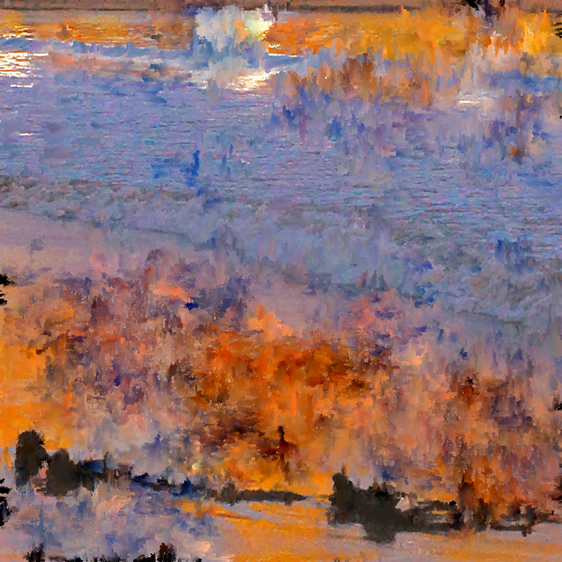
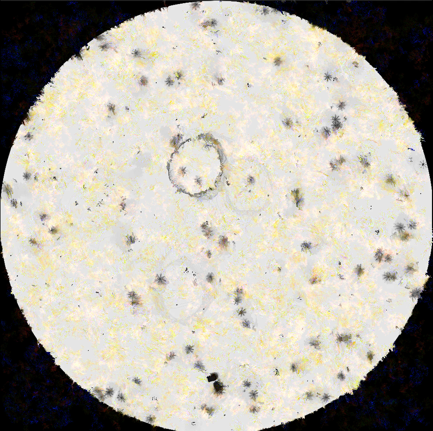
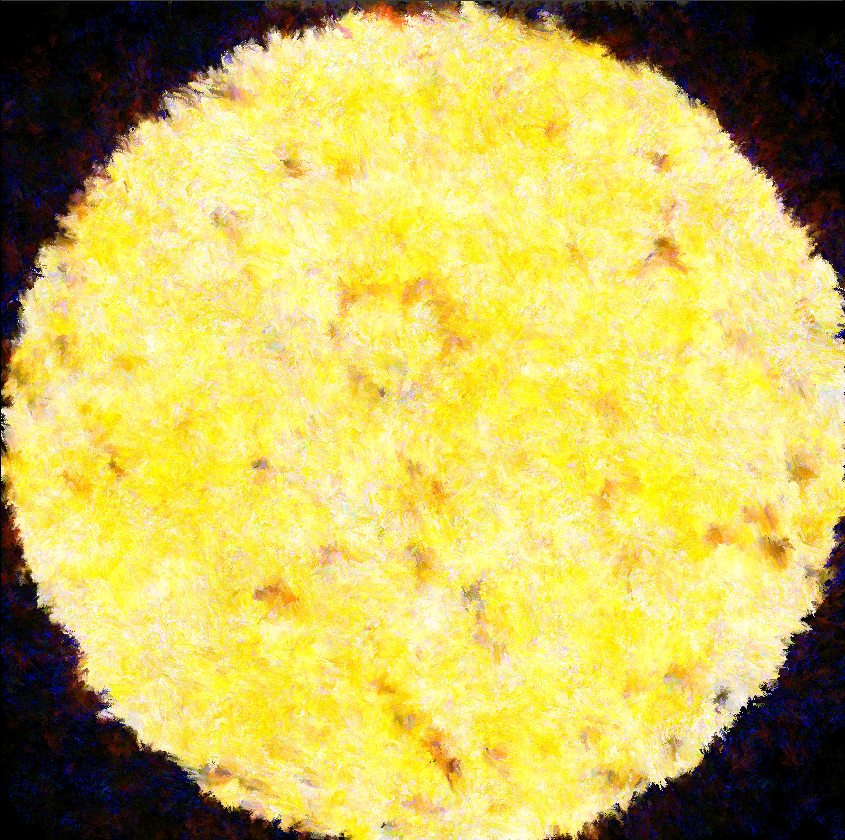

## 시작하기

접속 주소 : <http://ddong777.github.io/PoeticCodeForNature/>

 * 원한다면 테마를 변경할 수 있습니다. <https://pages.github.com/themes/> 페이지를 참고합니다.

## 최승희
   

  * 좋아하는게 많은 것 같아요.

  * 그림을 그리는 것도 좋아하고, 보는 것도 좋아합니다.
  * <좋아하는 화가>
  - Claude Monet
  
  - Bato Dugarzhapov
  
  # 이런 식으로 빛에 의한 다채로운 색의 변화를 표현한 그림들이 좋습니다.

  * 생물을 좋아합니다.
  * 바이오 아트를 접한 이후로 생명과 관련된 작업에 관심이 생기게 되었습니다.
  - Eduardo Kac, 창세기, 1999
  
  * 생명과 미디어작업을 연결할 수 있을까 해서 알게된 것이 computational generative art와 artificial life art 였습니다.
  * 엉성하지만 코딩으로 (개념적인)인공적인 생명체를 만들어보는 작업을 해보고 있습니다.
  
  
  

## 작업
 * [예시 작업](./example/)
 * [테스트](./test0501/)

 * [수업 작업1](./10print_test_0313_2)
 * [수업 작업2](./noise_test0325_2)
 * [수업 작업3](./worm0415)
