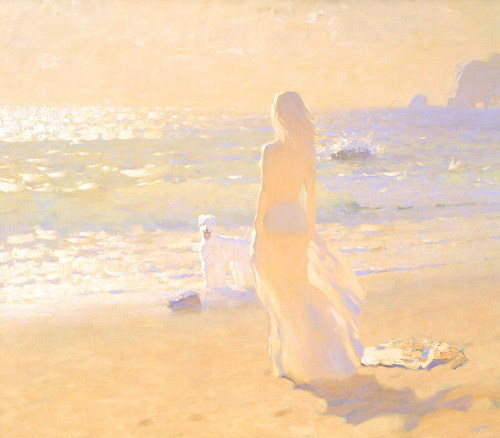

## 시작하기

접속 주소 : <http://ddong777.github.io/PoeticCodeForNature/>

 * 원한다면 테마를 변경할 수 있습니다. <https://pages.github.com/themes/> 페이지를 참고합니다.

## 최승희
   

  * 좋아하는게 많은 것 같아요.

  * 그림을 그리는 것도 좋아하고, 보는 것도 좋아합니다.
  * 좋아하는 화가
  - 
  - 

  * 생물도 좋아합니다.
  * 바이오 아트를 접한 이후로 생명과 관련된 작업에 관심이 생기게 되었습니다.
  - 
  * 그래서 요즘은 코딩으로 (개념적인) 인공생명체를 만들어보는 작업을 하고 있습니다.

## 작업
 * [예시 작업](./example/)
 * [테스트](./test0501/)
