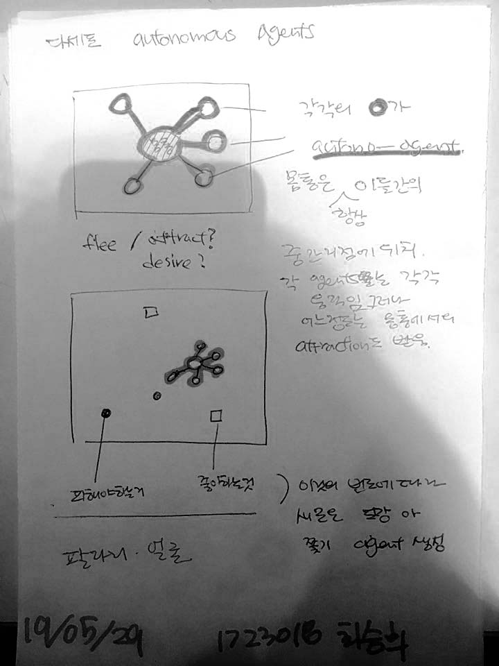

접속 주소 : <http://ddong777.github.io/PoeticCodeForNature/>

---------------------------------------

# 최승희
  - 이메일 : dj0603521@gmail.com
  - 인스타
    - 개인 : [@dj060352](https://www.instagram.com/dj060352/)
    - 팀 : STUDIO Silicagel [@studio_silicagel](https://www.instagram.com/studio_silicagel/)

   

---------------------------------------
## 나와 관련된 것

* 그림
  * 좋아하는 스타일
    - *Claude Monet*

    - *Bato Dugarzhapov*

  이런 식으로 빛에 의한 다채로운 색의 변화를 표현한 그림들이 좋습니다.

* 생물
  * 바이오 아트를 접한 이후로 생명과 관련된 작업에 관심이 생기게 되었습니다.
  - *Eduardo Kac*, 창세기, 1999
  
  생명과 미디어작업을 연결할 수 있을까 해서 알게된 것이 computational generative art와 artificial life art 였습니다.
  엉성하지만 코딩으로 (개념적인)인공적인 생명체를 만들어보는 작업을 해보고 있습니다.

---------------------------------------
## 개인 작업들
  - CELL2018

  - Image Decomposition

---------------------------------------

## 작업(수업)
 * [수업 작업1_10print](./10print_test_0313_2)
 * [수업 작업2_noise](./noise_test0325_2)
 * [수업 작업3_worm](./worm0415)
 * [수업 작업4_spread](./spread0415)
 * [수업 작업5_tentacle](./tentacleGenerator0415)
 * [수업 작업6_temtacle2](./tentacleGenerator0417)
 * [수업 작업7_plant](./plant0512)
 * [수업 작업8_box2D](./box2D_exercise0515/NOC_5_02_Boxes_myGit0515_ddong777)

---------------------------------------

## 기말 작업
  * 1 : 식물
  - 소스 이미지
  
  
  - 아이디어 스케치
  

 * 최종 결과물 - Roots Explosion

  
  - 몇세대를 걸쳐 계속 되는 식물의 생성적인면(분화하는 것)을 표현해보고자 함!
  - 원래는 식물의 가지로 표현하려고 했는데 그 형태가 가지보다는 뿌리에 가까워서 성장의 끝 이후에 새로운 생명(뿌리)가 생성되고 그 뿌리가 다시 또다른 생명을 생성시키고.. 하는 연쇄과정을 만들어내서 계속해서 이어지는 생명종의 생을 표현해보려 했습니다.
  - 뭔가 맹그로브 나무가 번식하는 모양이 생각나기도 하고 시간이 지날수록 더 많은 뿌리가 터지듯이 생겨나는게 폭발 같아서 roots explosion이라는 제목을 붙였습니다.

 * [실행 코드 : roots explosion](./roots_0622)

 * 2 : 다세포 생물
 - 소스 이미지 : 없음
 - 아이디어 스케치
 
* [실행 코드 : multcellular](./group_autoAgents_0624)
